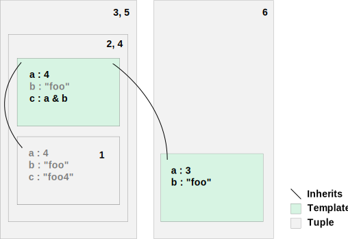

# The Flabbergast Programming Language

Flabbergast is a rather unique programming language. Conceptually, it is based on a proprietary programming language used at Google for creating configurations. At Google, this language is much despised because it is difficult to debug and has many design flaws. However, it is special in that it is a member of a unique language family. It has features from other languages: particularly functional languages and object-oriented languages. Flabbergast aims to be the second in that family of languages and, hopefully, be more loved by being easier to debug, easier to understand, and more semantically sturdy.

It is important to understand the niche for Flabbergast: it is a configuration language. The configuration of some systems is rather trivial: `fstab` and `resolv.conf` have remained virtually unchanged over many years. More complex programs, such as Apache, BIND, Samba, and CUPS have significantly more complicated configurations. The complexity is not a function of the configuration itself; indeed `smb.conf` is just an INI file. Complexity comes because there's a desire to share common configuration between elements (e.g., the list of privileged users among SMB shares). Configuration files start to grow awkward macro systems, get preprocessed using M4 or the like, or get evermore specific configuration operations to migrate the complexity into the binary.

Flabbergast, in some ways, is like a macro system. However, macro systems, such as M4 and the CPP, operate by manipulating text or tokens and can only ever output more text or tokens. Flabbergast is a language meant to manipulate structure configuration: tuples. Tuples can behave somewhat like objects: they can have inheritance relations, they can be extended, and, finally, rendered into a standard configuration format, which might be the tuples themselves or it could be text. Either way, the needs of the configuration remain in the Flabbergast language; not the binary consuming the configuration. Moreover, Flabbergast makes it possible to write libraries of utilities and templates for configurations.

## Core Concepts

There are two core concepts in Flabbergast: inside-out (dynamic) lookup and inheritance. Both of these exist in the context of tuples, which are the primary data structure. They somewhat resemble objects in Python, Perl and JavaScript.

A tuple is a map of names to values, including other tuples. Each tuple is immutable upon creation. The values in the tuple can be expressions (i.e., dynamically computed when the tuple is created); there are no methods as there are in other object oriented languages. Expression can reference each other and the Flabbergast interpreter will determine the correct evaluation order. Although tuples cannot be modified, new tuples can be created from existing tuples using fricassée (`For`) expressions that allow generation of tuples based on the values in existing tuples, much like SQL or XQuery statements produce new tables from existing tables. Tuples can also be instantiated from templates, which are essentially unevaluated tuples (i.e., the values of the attributes have not yet been computed).

Each tuple also has an evaluation context. In most languages, there are multiple scopes in which variables can be found. For instance, in C, the compiler tries to resolve a variable in the current block and proceeds through each containing block, then checks the function parameters, and finally global variables. Java is considerably more complicated as it needs to check not only the enclosing blocks and the function parameters, but also the fields of the class, and it has to make a distinction between static and instantiated fields, and inner classes are even more involved as the containing classes have to be checked. Flabbergast's algorithm for resolution is very simple, but can yield very complicated results.

Flabbergast uses inside-out lookup. It is easiest to think of resolution as having two dimensions: containment and inheritance. When resolving a variable, the language will first look for an attribute of the same name in the current tuple; if none exists, it will look in the containing tuple (i.e., the tuple in which the current tuple is an attribute) and will continue to examine containers until a matching tuple is found. If there is no match, resolution will continue in the parents of the template; that is, it will go to the context in which the template was defined and search through the containing tuples there. If that yields no matches, resolution will proceed back through the template's template's containers and back until there are no more contexts.

In the figure, there are two templates, shown in colour, and tuples, shown in grey. The tuple containment is indicated by physical containment and inheritance is shown by arrows. When resolution inside of the tuple marked 1 is needed, resolution begins in the tuple itself, then proceeds through the tuples, as indicated by their numbers. Note that some tuples are considered multiple times due to the template and the tuple sharing some containment; this is inconsequential, as it will either be found the first time, or fail every time. Note that templates themselves are not checked: only the tuples in which they were defined or modified.

Resolution has an extra complexity: chained accesses. Since tuples can be nested, it is desirable to access the attributes of an inner tuple using the `x.y` syntax. In most languages, resolution stops when the first name match is met (e.g., in Java, if there is a parameter `int foo` and a class field `String foo`, then `foo.charAt(3)` will fail to compile because `foo` has been resolved to the parameter, which is an `int` and so does not have the `charAt` method) while Flabbergast will attempt to find “the one you meant”. In the case of `x.y`, if a tuple `x` is found but it does not contain an attribute `y`, then the language assumes that this was not the `x` intended and _continues_ looking for an `x` does _does_ contain an attribute `y`. This means that the expression `x.y * x.z` can have two different tuples referenced for the first and second `x`! For instance, below, `b.z` will be 12 and the `a` in the `a.x` reference will be the top-level `a` while the `a` in the `a.y` reference will be `b.a`:

    a : { x : 3 }
    b : {
      a : { y : 4 }
      z : a.x * a.y
    }

In general-purpose programming languages, this idea sounds like madness, but Flabbergast is not a general-purpose programming language: it is intended to be used for writing configuration files. In that case, this feature allows brevity and clarity. If an SMB share looks for `users.admins`, it will pick up the one that is “closest” to the expression using it and, if the closest one does not provide that information, it must be somewhere else. Perhaps the best way to think of it is how human languages work:

> My father hates cats even though my mum likes them, so my parents never got a cat. When my sister moved out, she got a cat. My mum loves playing with her cat.

In the last sentence, to whom does _her_ refer? While _my mum_ is the closest noun that could match _her_, it has been previously established that my mum does not have a cat, so _her cat_ wouldn't make sense. Because we treat _her cat_ as a unit, we contextually keep looking for a _her_ that does have a cat, which would be _my sister_. Conceptually, this is how Flabbergast's resolution algorithm works: it finds the match that makes the most contextual sense.

Inheritance allows creation of attributes, in addition to providing a history for contextual lookup. A tuple or template is a collection of key-value pairs, where each key is a valid identifier and a value can be any expression. A template can be “modified” at the time of instantiation or through the `Template` expression, which creates a new template that copies all the existing attributes, less the modified ones. In most object oriented languages, fields and methods can be overridden (i.e., replaced with new code). Similarly, attributes can be overridden with new expressions. Some languages allow access the overridden method through special keywords (e.g., Java's `super`, C#'s `base`, or Python's `super()`). Flabbergast permits accessing the original attribute, but a new name must be specified; there is no default name like `super`. Unlike most languages, Flabbergast permits deletion of an attribute. Because of inside-out lookup, any other attributes referencing the deleted attribute will simply look elsewhere. 

Since attributes can refer to each other, it is the interpreter's duty to determine the order to evaluate the expressions. This means that attributes can be specified in any order (unlike C and C++). In fact, inside-out lookup makes it impossible to determine to what attributes references refer until evaluation time. One unusual effect is that the inheritance path of a tuple can be changed at runtime (i.e., the “class” heirarchy is not determined at compile-time)! In fact, since templates can be instantiated in different contexts, it is possible for the same declaration to be used in different contexts that create two different tuple inheritance paths. Obviously, this is the kind of stuff that can be used for good or evil–there are legitimate reasons to re-parent tuples, but it can be very confusing and cause unexpected behaviour.

The interpreter must be able to linearise the order in which it will perform evaluations. If the expression evaluation contains a cycle, then it is not possible to evaluate any of the expressions in the cycle. This is called _circular evaluation_. While theoretically possible, determining a fixed point is a rather impractical proposition. There are pseudo-cycles that are acceptable: the expressions can refer to one-another circularly so long as they don't need the value. This happens mostly during inside-out lookup:

    x : {
      w : 4
      z : y
    }
    y : x.w

Here, `x` as a tuple, cannot be completely evaluated because the attribute inside `z` depends on the value of `y`, which in turn, depends on `w`, inside of `x`. Although there is cross-reference into and out of `x`, there is an order that works: evaluate `x` to be a tuple with attributes `w` and `z` (though do not evaluate them), evaluate `x.w`i to be 4, evaluate `y` to be 4, and finally `x.z` to be 4. Here is an example of true circularity:

    x : y
    y : x

or even more succinctly:

    x : x

Usually, the intended meaning of this expression is:

    {
      x : Lookup x In Container
    }

## Syntax

In Flabbergast, all keywords start with a capital letter and identifiers start with a small letter, making them easily distinguishable. There are also a number of special characters used for operators. Comments being with `#` and terminate at the end of the line. For the purposes of code formatting, comments preceding an attribute are assumed to be associated with it.

### Types and Constants

Flabbergast has a small handful of types: integers (`Int`), floating pointer numbers (`Float`), Boolean values (`Bool`), text strings (`Str`), tuples (`Tuple`) and templates (`Template`).

Integral and floating point number literals are specified in the familiar way. They can also be manipulated using the typical `+`, `-`, `*`, and `/` operators and integers also support the `%` operator. In mixed-type expressions, integers are automatically promoted to floating point numbers. They also can be compared using `==`, `!=`, `<`, `<=`, `>`, `>=`, and `<=>`. The `<=>` operator will be familiar to Perl and Ruby programmers: it compares two values and returns -1, 0, or 1 if the left operand is less than, equal to, or greater than the right operand, respectively. There is also a unary negation operator `-`. A few floating point exceptional tests are provided: `Is Finite` and `Is NaN` to check if the number is finite or not-a-number in the IEEE sense, respectively. Also, the floating point constants `NaN`, `Infinity`, `FloatMax`, and `FloatMin`, and integer constants `IntMax` and `IntMin` are provided.

The Boolean constants provided are `True` and `False` that can be manipulated using the operators `&&`, `||`, and `!`. They can also be compared using the full set of comparison operators; true is considered to be greater than false. There is no separate exclusive-or operator as `!=` serves this role. Both `&&` and `||` are short-circuiting.

String literals, delimited by double quotation marks, can cover multiple lines and can contain embedded escape sequences and expressions. The escape sequences supported include the single-character escapes supported by C, triplets of octal digits, pairs of hexadecimal digits, and Unicode-friendly quadruplets of hexadecimal digits. Embedded expressions start with `\(`, followed by an expression, and terminated with a matching `)`; the expression must return a string, or a type that can be coerced to a string. Strings can also be joined together with the `&` operator. For example, `a` and `b` will have the same value and both embed a reference to `x`, which is an integer, and so converted to a string:

    x : 3
    a : "foo=\(x)\n"
    b : "foo=\(x)
    "

Sometimes, attribute names are provided as strings and, since not all strings are valid attribute names, it is useful to have a way to create a string that is a valid attribute name. By placing `$` before a valid identifier, a string with the identifier name will be created.

    x : $foo == "foo" # True
    y : $5 # Error

Tuples are collections of attributes. Literal tuples are specified starting with `{`, followed by a list of attributes, and terminated with a matching `}`. Each attribute is a name, followed by `:`, and an expression. Tuples inherit the context of the tuple in which they are defined. Templates look similar except that they are preceded by the `Template` keyword. There are two important differences between templates and tuples: tuples are immutable while templates can be manipulated and variable resolution can look inside tuples, but not inside of templates. Neither can be coerced to strings. More details on tuples are provided later.

There is also a special `Null` constant which can be checked for using the `Is Null` operator. The null value cannot be used in any comparison operator and doing so will cause an error. The null value is not the same as an undefined variable. There is a null coalescence operator `??` that can substitute a default value if the left operand is null. Unlike most languages, null should be used extremely sparingly in Flabbergast: it is usually preferable to let inside-out lookup find appropriate values. Null should mean “this value is not helpful and that's the final word” instead of the usual meanings of “I don't know” or “this does not exist”. As an example, `y` will be 3, `z` will be an error, and `w` will be true.

    x : Null
    y : x ?? 3
    z : x == Null
    w : x Is Null

The `To` operator can be used to coerce values to other types. Integral and floating point types can be inter-converted, with appropriate truncation, and converted to strings. The `As` operator ensures that a value is of a particular type, if not, an error occurs. The `Is` operator checks whether a value is a particular type and returns the result as a Boolean value.

    x : 3 As Str # Null
    y : 3 To Str # "3"
    z : 4.5 Is Int # False

The `As` operator is shorthand for `If value Is Type Then value Else Null`.

### Special Tuple Literals

Two special tuple literals are provided: the literal list and the range operator.

Tuples are implicitly sorted by their attribute names. The literal list is a way to create a tuple with only values and the names are set to arbitrary labels that have a guaranteed stable sorting. It is a comma-separated list of expressions starting with a `[` and terminating with a `]`.

The `Through` operator produces a list with the values being numbers starting from the left operand up to, and including, the right operand, both of which must be integers. If the right operand is the same or less than the left, the list returned will be empty.

The values of the following tuples are all exactly the same:

    x : [ 1, 2, 3 ]
    y : 1 Through 3
    z : {
      a : 1
      b : 2
      c : 3
    }

### Flow Control

A conditional expression is provided: `If`, an expression which returns a Boolean value, `Then`, an expression to be returned if the first expression is true, `Else`, an expression to be returned if the first expression is false. The statement, very importantly, impacts inside-out lookup. Free variables in the `Then` and `Else` expressions are not resolved unless that expression is selected. This means that they can contain invalid references without causing an error. For instance, `y` will be 5 and no error will occur even though `z` is not defined.

    x : 5
    y : If x < 10 Then x Else z

The `Error` expression raises an error, stopping execution of the whole program. Any expression attempting to consume the return value of this expression will fail to evaluate.

    x : 5
    y : If x < 10
      Then x
      Else Error "The value \(x) is too large."

### Lookup

A period-separated list of identifiers forms a free variable to be resolved by inside-out lookup; this is called contextual lookup.

    a : 5
    b : {
      c : a + 3
    }

Here, in `b.c`, lookup will start in the current tuple, which does not contain `a`, so lookup will continue to the containing tuple, which does have `a`.

A period-separated list of identifiers can also be added to any expression, in which case it will do exact matching starting from the expression supplied; this is called a direct lookup. The keyword `This` gives access to the tuple where the expression is being evaluated, effectively forcing direct lookup. Using parentheses or the result of an expression will also result in direct lookup.

     x : 1
     a : {
       x : 3
       y : This.x + 1 # Yields 4
     }
     b : (a).x # Yields 4

The keyword `Container` access the parent of the tuple (either the current tuple if it is used alone, or the preceding tuple if used in an inside-out or direct lookup).

     a : 1
     b : {
       a : Container.a # Yields 1
     }

The `Lookup` expression performs a remote inside out lookup; `Lookup a.b.c In x` will start inside-out lookup for `a.b.c` starting from the context of the tuple `y`, rather than the current context.

Here is non-trivial example uses of all lookup styles:

    a : {
      h : i - 1 # Yields 4 - 1 = 3
    }
    i : 4
    x : a.h # Will be 3
    y : a.i # Will be an error
    z : Lookup i In a # Will be 4
    w : {
      a : {
        i : 2
      }
      x : a.h # Will be 3
      y : a.i # Will be 2
      z : Lookup i In a # Will be 2
      v : (a).h # Will be an error
    }

In `a`, contextual lookup searches for an `i`, which does not exist in the current tuple, but does exist in its parent. In `x`, contextual looks for an tuple `a` that contains an attribute `h`, which it finds at the top-level. In `y`, although `i` is accessible from the tuple `a`, it does not exist in `a`, so `a.i` fails to find a matching tuple. However, in `z`, a remote lookup searches for `i` starting from `a`, which is found in exactly the same way as when computing the value for `a.h`. Inside `w`, the situation is more complicated as another tuple named `a` is created. Searching for `a.h`, as `w.x` does, first checks the tuple `w.a`, but this tuple lacks an `h` attribute, so lookup continues, instead finding the top-level tuple. In `w.y`, lookup for `a.i` will match the `w.a` tuple as it does have an `i` attribute. In both `w.z` and `w.v`, searching for `a` yields `w.a`. In the case of `w.z`, doing a remote lookup inside `w.a` for `i` will find the attribute inside it. In the case of `w.v`, the parentheses have broken the lookup into a contextual lookup (`a`) and a direct get (`.h`); this is an error as the matched `a` (`w.a`) does not have an attribute `h`.

### Fricassée Expressions

Although tuples are immutable, it is possible to create new values from existing tuples using fricassée expressions. These expressions take a collection of input tuples an iterate over the attributes they share. The concept was based on XQuery's FLOWR expressions, which are based on SQL queries. It should be familiar to users of Haskell and LISP's `map` and `fold` functions, C#'s LINQ expressions, Python's `map` and `reduce` operators, or Perl's `map` construct. Conceptually, the expression has three parts: a source, an optional filter, and a sink. The source extracts data from tuples and produces a context in which each subsequent expression will be evaluated. The filter can discard any contexts that do not meet certain requirements. The sink produces a value from the contexts: either a new tuple, or a single value for a reduction. Some sinks respect the ordering of the contexts, so there are common ordering tools.

There are two sources provided: the combined attributes of tuples, and, prepared context tuples. In all cases, the select is done over a collection of input tuples and all the attributes of the input tuples. The following example shows the first part of a fricasée expression for different sources over the same input tuples. In the first three cases, the source will iterate over the union of all the attributes in the tuples `x`, `y`, and `z` and each context will have `a`, `b`, and `c` bound to the values in the corresponding tuples, or `Null` if there is no corresponding value. For the values only source, `i`, this is all the context will contain. In the case of `j`, the attribute name itself will be bound as `n` in a string, using the special `Name` value. In the case of `k`, the position will be provided using the special `Ordinal` value; indexing starts from 1.

    x : {
      p : 1
      q : 2
    }
    y : {
      p : 3
      q : 4
    }
    z : {
      p : 5
    }
    i : For a : x, b : y, c : z ... # Yields { a : 1  b : 3  c : 5 }, { a : 2  b : 4  c : Null }
    j : For n : Name, a : x, b : y, c : z ... # Yields { a : 1  b : 3  c : 5  n : "p" }, { a : 2  b : 4  c : Null  n : "q" }
    k : For n : Ordinal, a : x, b : y, c : z ... # Yields { a : 1  b : 3  c : 5  n : 1 }, { a : 2  b : 4  c : Null  n : 2}
    l : For Each [ x, y, z ] ... # Yields { p : 1  q : 2 }, { p : 3  q : 4 }, { p : 5 }

The prepared tuple source, `Each`, is meant for library functions to produce iterable sources of data. One could imagine a library function matching a regular expression and returning the matched groups. It becomes the responsibility of the source to provide sensible variables in each tuple. In the example, `z` makes for an awkward environment since `q` is not bound, and the `Each` source is not obligated to correct the inconsistency.

Optionally, a `Where` clause can be used to filter the results. It must return a Boolean value.

    x : 1 Through 7
    i : For a In x Where a > 5 ... # Yields { a : 6 }, { a : 7 }

Finally, a sink is needed to produce a value from the contexts. Three are supported: a reducer, an anonymous tuple generator, and a named tuple generator. The reducer and the anonymous tuple generator both support ordering.

The reducer works as a typical fold/reduce operation:

    x : 1 Through 7
    y : For v In x Reduce v + a With a : 0

The initial value of the accumulator, `a`, is set to zero and the reduce expression is repeated for each of the contexts. In each context, the accumulator will be bound to the previous value. The reducer can support ordering operations, shown later, on the contexts to choose the reduction order.

The anonymous tuple generator produces a new tuple with each value being the result of an expression. The names of the tuples are generated automatically in the same way as if they had been generated by a literal list or `Through` expression.

    x : 7
    y : For v In (1 Through x) Select v * v # Produces a list of squares

Because multiple input tuples can be provided, much like LISP's variadic `map`, it also functions like Haskell's `zip`:

    x : [ 1, 2, 3 ]
    y : [ 4, 5, 6 ]
    z : For a, b In x, y Select a + b # Element-wise sum of the lists

The anonymous tuple generator can support ordering operations, shown later, on the context to choose the order of the output.

The named attribute tuple generator produces a tuple where the element names are provided as strings:

    x : 1 Through 3
    y : For a In x Select "foo\(x)" : x # Produces the tuple { foo1 : 1  foo2 : 2  foo3 : 3 }

The name provided must be a valid identifier, which is not true of all strings, otherwise an error will occur. This named attribute tuple generator does not support ordering operations since the order of attributes in a tuple is controlled by their names.

Presently, there are two ordering operations: `Reverse` reverses the order of the input and `Order By` produces a sorting item.

    x : -3 Through 3
    y : For a In x  Reverse  Select a # Yields [ 3, 2, 1, 0, -1, -2, -3 ]
    z : For a in x  Order By If a < 0 Then -a Else a  Select a # Yields [ 0, -1, 1, -2, 2, -3, 3 ]

Note that if two values have the same sort key, in the example -1 and 1 do, then the order between them is not guaranteed. Any type that can be compared using the `<=>` can be used as a sort key, but all must be of the same type.

### Tuples and Templates

In addition to literal tuples, tuples can be instantiated from templates. The instantiation can also modify a template by adding, removing, or overriding attributes. The syntax for instantiation is simply an expression yielding a template followed by `{`, an optional list of modifications, and terminated by `}`. Templates are created in a syntax similar to literal tuples: `Template {`, a list of attributes, followed by `}`.

    foo_tmpl : Template { a : b + 4 }
    foo : foo_tmpl { b : 3 } # Yields { a : 7  b : 4 }

Templates can also be derived using a syntax that is a hybrid of the two: `Template`, an expression for the template from which to derive, followed by `{`, an optional list of modifications, and a terminating `}`. It's important to note that deriving a template, even with no changes, modifies it because it adds additional lookup scopes. In general, it's useful think of the curly braces and capturing scope. In this example, `foo2_tmpl` is capturing the scope inside of `x`, making `b` available to its descendants.

    foo_tmpl : Template { a : b + 4 }
    x : {
      foo2_tmpl : Template { }
      b : 1
    }
    y : x.foo2_tmpl { } # Yields { a : 5 }

There are several modification attributes, not all of which can be used in all contexts:

 - `:`, followed by an expression, simply defines an attribute to be the supplied expression. If there previously was an attribute of the same name, it is discarded.
 - `?:` creates an attribute that is always an error. This can be thought of as an _abstract_ attribute, in the C++/Java/C# terminology. This is not permitted during instantiation.
 - `-:` deletes an attribute. The attribute must already exist, so this is not valid when declaring a new template.
 - `+`, followed by an identifier, then `:`, followed by an expression, will replace an attribute but allows the previous value to be bound to the identifier supplied. The attribute must already exist, so this is not valid when declaring a new template.
 - `+: {`, followed by a list of modifications, terminated by `}`, performs template derivation. It is short-hand for `+oldtemplate: Template oldtemplate { ... }` with the convenience of not having to choose a name.

There is also a function call convenience syntax. In their own way, templates can act as lambdas. In tuple instantiation, the expressions are evaluated in the context of the tuple created. In a function call, expressions provided are evaluated in the current (parent) context, then placed into the instantiated template. A list of unnamed expressions can be provided and these are collected into an `args` tuple. Finally, instead of simply returning the entire tuple, the `value` attribute is returned from the instantiated tuple. For instance, the function call:

    {
      a : 3
      b : 2
      c : 1
      z : f(a, b, c : c)
    }

is rewritten as:

    {
      a : 3
      b : 2
      c : 1
      z : f {
        args : [ 3,  2 ]
        c : 1
      }.value
    }

In this example, `c` would be circular evaluation when using normal evaluation semantics, but because the evaluation of the parameters happens in the containing context, this is fine.

### Miscellaneous

The `Let` expression allows binding a value to a new name. For example, `Let a: 3 In a * a`. This is a convenient way to eliminate common subexpressions. Be advised that the normal short-circuiting rules do not apply: all the values in the expression must be evaluated first. Multiple variables can be bound at once (e.g., `Let a: 3, b: 4 In a * a + b * b`).

The `From` expression allows importing external content into the program. This does two jobs: allows accessing libraries and allows access information for the program being configured. The `From` keyword is always followed by a URI. The `lib:` URI is  used for the standard library. The `file:` URI may also be supported. By convention, it is best to do all the importing at the start of a file:

    foo_lib : From lib:foo

Supposing this was CUPS, it might be perfectly reasonable for CUPS to provide a list of backends (e.g., parallel port, USB, IPP):

    known_backends : From cups:backends
    # Function-like template to determine if a backend is supported by CUPS
    supported_backend : Template {
      backend ?:
      value : For known_backend In known_backends Reduce accumulator || backend == known_backend With accumulator : False
    }

Implementation-specific keywords start with `X`. They should not be used in most code, but are often present in libraries to support binding to the underlying platform.

## Using the Language

The language is meant for creating configurations. What, precisely, is a configuration? Or, more specifically, how is it different from regular code?

Certainly, Flabbergast is a bad choice for writing a GUI application, or a data processing pipeline. It's almost useful to think of Flabbergast as something like a compiler: it takes highly structured data and outputs very simple data. Effectively, it is meant to render data. What the language is attempting to do is make it easy to compress the duplication in a very ad-hoc way. Real compilers for real languages are large, complicated, and, hopefully, well-designed. Flabbergast aims to help you put together a very simple language with almost no effort. As such, it's not going to do everything right; it's going to rely on the user to put in moderately sane input and that the downstream consumer will validate the input.

In most languages, afterthoughts are not appreciated. However, most configurations are nothing but afterthoughts and exceptions. “I want the test version of the webserver to be the same as the production except for the database connection.” “I want the videos SMB share to be the same as the documents SMB share with a few extra users.” Flabbergast is built to service “except”, “and”, and “but”. Everything is malleable and done in such a way that it can be changed even if the base version didn't anticipate that change. There's no concept of Java's `final`, or C++'s `const`.

Most languages, particularly object-oriented languages, have a lot of plumbing: taking data from one place and copying it to another. Most constructors in object-oriented languages spend their time stuffing parameters into fields. There is a push in multi-paradigm object-oriented languages, including Scala, Ruby, Groovy, Boo, and Nemerle, to have the compiler write the plumbing, freeing the programmer to work on the real logic. Flabbergast has a different approach: don't have plumbing at all. Define the data where it should be defined and use inside-out lookup to pull data from the wherever. Copying data is generally a sign that inside-out lookup is not being used effectively.

Although Flabbergast has the `?:` attribute definition, it should almost never be used. This is one of the most frequent mistakes of novice programmers. If there's a value needed, just use it; there's no need force the consumer of a template to fill in the blank. The real use case is for things that must be provided and unique. For instance, the name of an SMB share is probably best defined with `?:`, but the users certainly are not.

The most important feature of Flabbergast is overriding. When starting out with Java or C#, understanding how to divide things up into objects is the hard part. When starting out with ML or Haskell, understanding how to make things stateless is the hard part. When starting out with Flabbergast, understanding  how to make things easy to override is the hard part.

### First Example
TODO

## Patterns
TODO

## The Standard Library
TODO
